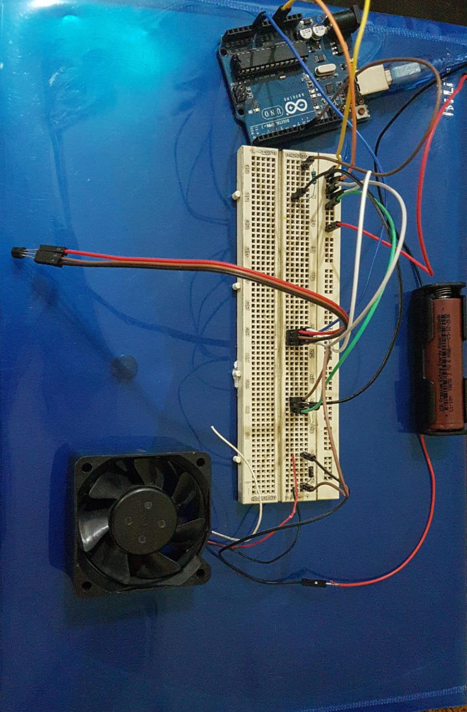
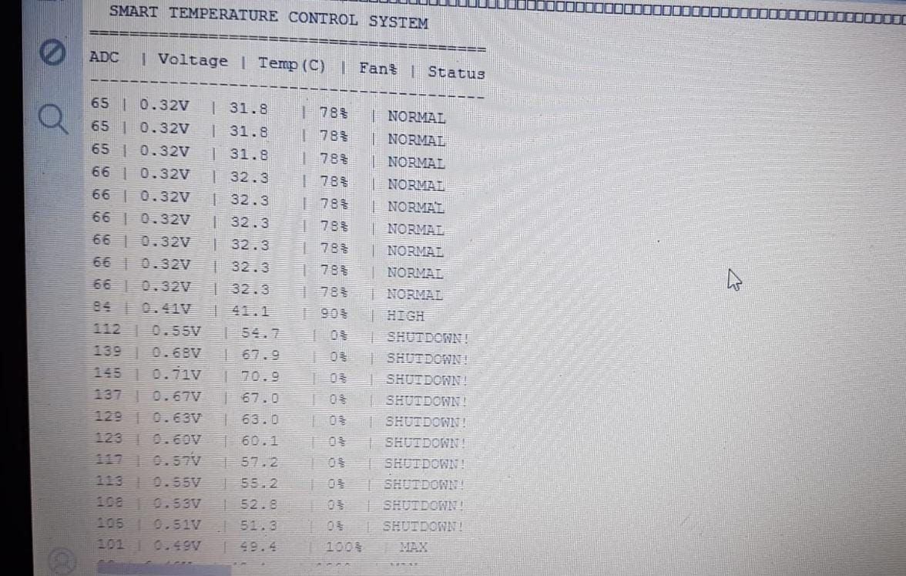
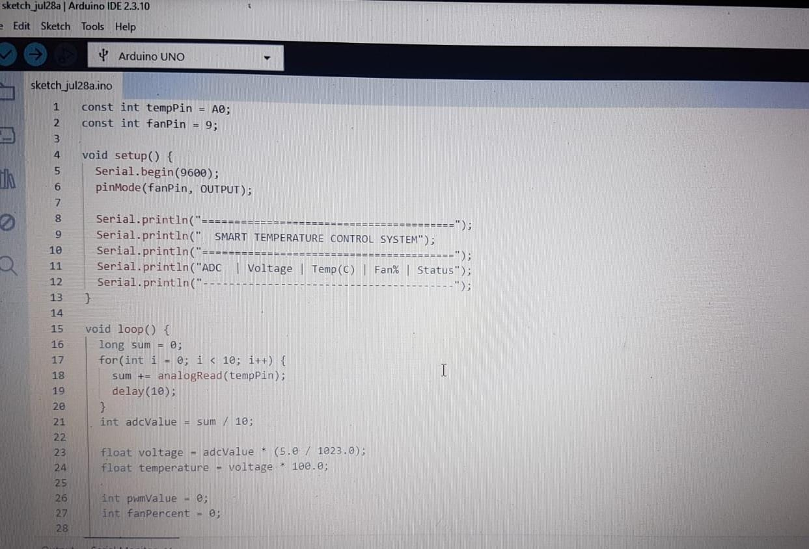
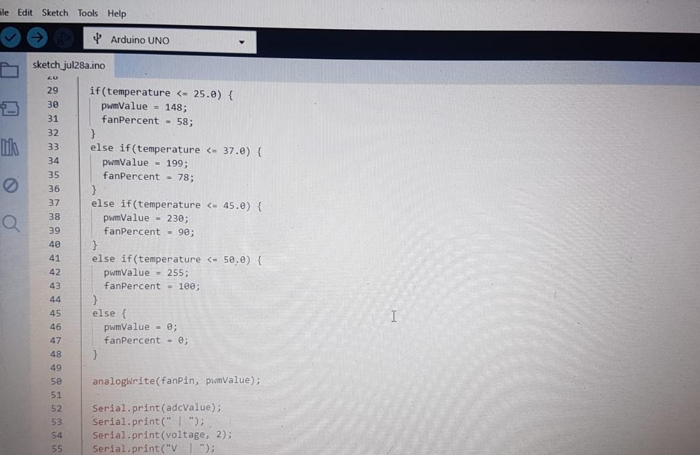
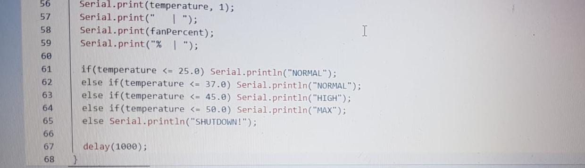

<div align="center">

# 🌡️ Smart Temperature-Controlled Cooling Fan System

### An Embedded Real-Time Monitoring & Control Project | Arduino + C++


</div>

---

## 👤 Author & Course Details

| Field | Detail |
|---|---|
| **Name** | Tanseer Haider |
| **Roll Number** | SU91-BSEEM-F25-002 |
| **Program** | BS Electrical Engineering |
| **Semester** | 2nd Semester |
| **Course** | Computer Programming (C++) |
| **University** | Superior University |
| **Role** | Sole developer — circuit design, Arduino firmware, and C++ monitoring application |

---

## 📌 Problem Statement

Cooling systems that run at a fixed, constant speed are inefficient — they waste energy when cooling isn't needed and provide inadequate protection when temperatures rise sharply. There is also typically no live, human-readable record of how temperature behaves over time, making it difficult to observe system performance or diagnose issues.

## 💡 Solution

This project implements a **real-time, sensor-driven cooling control system**. An **Arduino Uno** continuously samples ambient temperature through an **LM35 analog temperature sensor**, converts the reading into an accurate Celsius value, and adjusts a **DC cooling fan's speed proportionally via PWM** — the hotter it gets, the faster the fan runs, automatically and without manual intervention.

Every reading (raw ADC value, sensor voltage, temperature, fan speed percentage, and system status) is streamed live over **Serial communication** to a custom-built **C++ desktop application**, which parses the incoming data and renders it as a **live, color-coded console dashboard** that refreshes every second — giving a clear, real-time view of exactly what the hardware is doing.

A built-in **safety layer** protects the system from unsafe operating conditions: a **warning is triggered at 87% fan speed**, and the system **automatically shuts the fan down at 90%** — a simplified software analogue of the overload-protection logic used in real electrical and industrial systems.

---

## 🛠️ Tech Stack & Key Features

**Languages & Tools**
- **C++** — both the Arduino firmware and the Windows desktop monitoring application
- **Arduino IDE** — embedded firmware development and upload
- **Dev-C++ (MinGW / g++)** — desktop application development, Windows Serial API

**Hardware Components**

| Component | Purpose |
|---|---|
| Arduino Uno | Reads the sensor, runs the control logic, drives the fan, and streams live data |
| LM35 Temperature Sensor | Converts ambient temperature into a proportional analog voltage (10 mV/°C) |
| DC Cooling Fan | The actuator being controlled — speed varies with PWM duty cycle |
| Li-ion Rechargeable Battery Pack | Powers the circuit |
| Breadboard & Jumper Wires | Circuit prototyping and connections |

**Key Features**
- ✅ 100% real sensor data — no hardcoded, random, or simulated values
- ✅ Automatic closed-loop fan control based on live temperature (ADC → Voltage → °C → PWM)
- ✅ Multi-tier response: `NORMAL → HIGH → MAX → SHUTDOWN` based on live temperature thresholds
- ✅ Live Serial communication between Arduino and a custom C++ application
- ✅ Color-coded, live-refreshing console dashboard (updates every second)
- ✅ Averaged ADC sampling (10 readings per cycle) to reduce sensor noise
- ✅ Software safety interlock — automatic shutdown above a defined fan-speed threshold

---

## 🔄 System Working — Signal Flow

```
 Ambient Temperature
         │
         ▼
   LM35 Sensor  ──────────►  Analog Voltage (10 mV per °C)
         │
         ▼
 Arduino ADC (A0)  ────────►  Digital Value (0–1023)
         │
         ▼
   Firmware Logic  ─────────►  Temperature (°C) calculated
         │
         ▼
  Threshold Check (if–else)  ─►  Fan Speed % + PWM value decided
         │
         ├──────────────► PWM Signal → Fan spins at calculated speed
         │
         └──────────────► Data sent over Serial (ADC | Voltage | Temp | Fan% | Status)
                                     │
                                     ▼
                         C++ Desktop Application (Dev-C++)
                                     │
                                     ▼
                     Live Color-Coded Console Dashboard (updates every 1s)
```

---

## ⚙️ Installation & Usage Instructions

### 1. Hardware Setup
Connect the circuit as follows (see `/screenshots/hardware_setup.jpg`):
- LM35 **output pin** → Arduino **A0**
- LM35 **VCC** → Arduino **5V**, LM35 **GND** → Arduino **GND**
- Fan control line → Arduino **Pin 9 (PWM)**
- Battery pack supplies circuit power via the breadboard rails

### 2. Upload the Arduino Firmware
```bash
# Open in Arduino IDE
Arduino/FanControl.ino

# Tools → Board → Arduino Uno
# Tools → Port → select the correct COM port
# Click Upload
```

### 3. Run the C++ Monitoring Application
```bash
# Open in Dev-C++
CPP/FanMonitor.cpp

# Compile & Run (F11)
# When prompted, enter the Arduino's COM port number (e.g. 4)
```

> ⚠️ **Important:** Close the Arduino IDE's Serial Monitor before running the C++ application — only one program can access a COM port at a time.

---

## 📊 Control Logic (Temperature Thresholds)

| Temperature Range | Fan Speed | PWM Value | Status |
|---|---|---|---|
| ≤ 25.0 °C | 58% | 148 | NORMAL |
| 25.1 – 37.0 °C | 78% | 199 | NORMAL |
| 37.1 – 45.0 °C | 90% | 230 | HIGH |
| 45.1 – 50.0 °C | 100% | 255 | MAX |
| > 50.0 °C | 0% | 0 | SHUTDOWN! |

---

## 📸 Screenshots & Visuals

**Hardware Circuit Setup**


**Live Serial Output — Real Sensor Readings**


**Arduino Firmware (Setup & Initialization)**


**Arduino Firmware (Control Logic)**


**Arduino Firmware (Serial Output Logic)**


---

## 🎓 Learning Outcomes

This project applies core Computer Programming concepts in a real embedded context:
- **Functions** — modular, reusable blocks for reading, parsing, and displaying data
- **Loops** — continuous sampling and live monitoring
- **Conditional logic (if–else)** — multi-tier decision-making for fan control and safety
- **Serial/string parsing** — converting raw Serial data into usable numeric values
- **Real-world analog-to-digital signal processing** — ADC sampling, voltage conversion, and noise averaging

---

<div align="center">

*Submitted as part of the Computer Programming course — Semester 2, BS Electrical Engineering, Superior University.*

</div>
